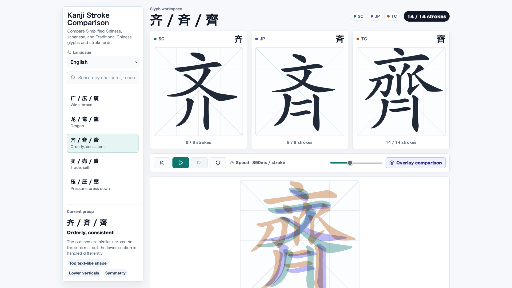

# CJK Stroke Compare

<p align="center">
  <a href="README.md">English</a> |
  <a href="README.zh-CN.md">简体中文</a> |
  <a href="README.zh-TW.md">繁體中文</a> |
  <a href="README.ja.md">日本語</a> |
  <a href="README.ko.md">한국어</a>
</p>

CJK Stroke Compare는 중국어 간체, 일본 신자체, 중국어 번체의 글리프와 획순을 비교하는 로컬 우선 도구입니다. 현재 152개의 주요 차이 글자 그룹을 포함하며, 획별 재생, 오버레이 비교, 검색, 차이 설명을 지원합니다.



## 기능

- 중국어 간체, 일본 신자체, 중국어 번체의 글리프를 비교합니다.
- 획순을 한 획씩 재생합니다.
- 지역별 글리프를 겹쳐 보며 형태 차이를 확인합니다.
- 글자, 의미, 비교 포인트로 검색합니다.
- 획 데이터 생성 후에는 실행 시 로컬 JSON만 읽습니다.

## 로컬 실행

```bash
npm install
npm run data:build
npm run dev
```

기본 로컬 개발 URL은 `http://127.0.0.1:5173/`입니다.

## 빌드

```bash
npm run build
```

## 데이터

`src/data/characterGroups.json`는 선별된 글자 그룹과 설명 문구를 관리합니다. `npm run data:build`는 AnimCJK의 중국어 간체, 중국어 번체, 일본어 글리프 데이터셋에서 대상 글자를 추출한 뒤 로컬 `src/data/strokes.json` 파일을 생성합니다. 앱은 실행 시 로컬 JSON만 읽으며 외부 네트워크에 의존하지 않습니다.

데이터 출처:

- [AnimCJK](https://github.com/parsimonhi/animCJK)

## 라이선스

이 저장소의 원본 애플리케이션 소스 코드는 MIT License로 라이선스됩니다. `src/data/strokes.json`의 생성된 획 데이터는 AnimCJK 그래픽 데이터 파일에서 파생되었으며 Arphic Public License(`Arphic-1999`)에 따라 배포됩니다. 자세한 내용은 `THIRD_PARTY_NOTICES.md`와 `licenses/ARPHICPL.TXT`를 참고하세요.

관련 프로젝트 및 참고 자료:

- [Make Me a Hanzi](https://www.skishore.me/makemeahanzi/)
- [Hanzi Writer](https://hanziwriter.org/docs.html)

## 감사

이 프로젝트는 Codex의 vibe coding 지원을 활용해 작성했습니다.
